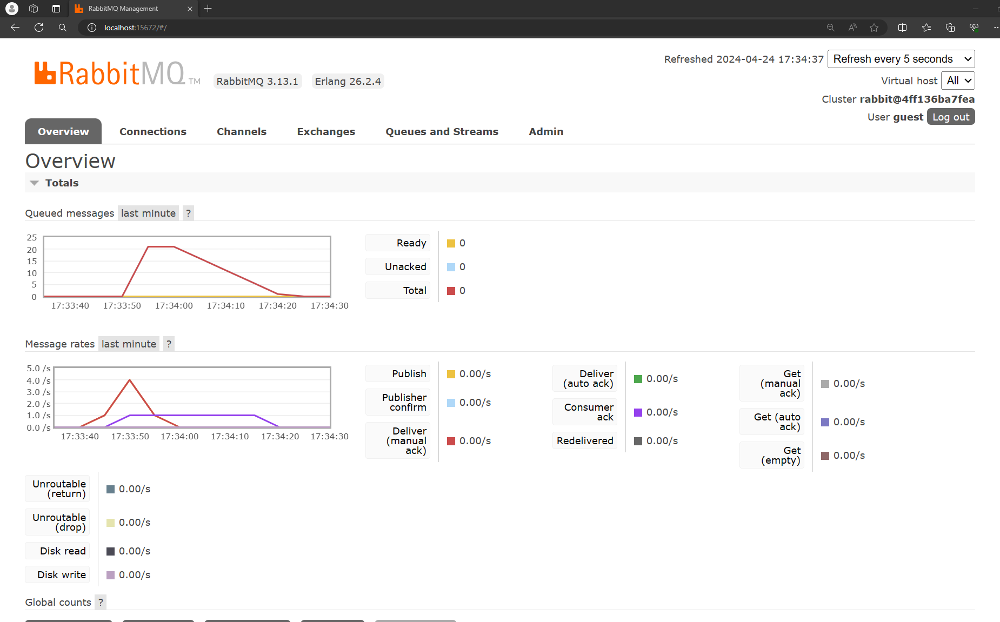

### 1. what is amqp?
Advanced Message Queuing Protocol is a protocol used for sending messages between systems reliably and securely, ensuring that data is delivered even if some parts of the system fail.

### 2. what it means? guest:guest@localhost:5672 , what is the first quest, and what is the second guest, and what is localhost:5672 is for? 
- guest (1st) : username
- guest (2nd) : password
- localhost : hostname
- 5672 : port

## Screenshots
### Slow subscriber simulation

It shows a total of about 21 queues because I ran the `cargo run` command 5 times. The delay comes from the line `thread::sleep(ten_millis);` in the subscriber program, which makes it pause for 10 milliseconds. This simulates a slow subscriber, causing the delay.